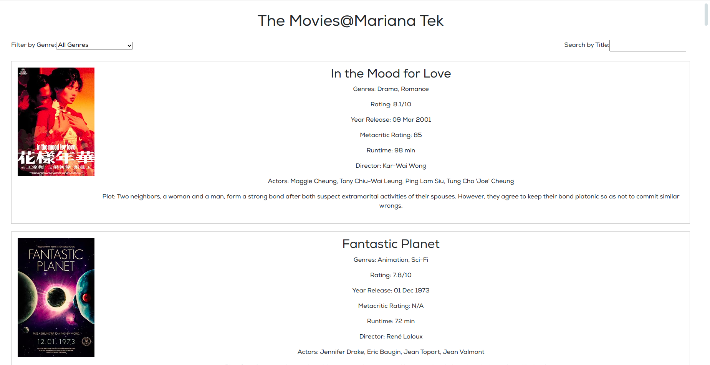

# Movie Listing App

The Movie Listing App is a web application that allows users to browse and search for movies. Users can filter movies by genre and search for specific movie titles. The app provides detailed information about each movie, including its title, genre, rating, release year, and more.



## Features

- View a list of movies with their details
- Filter movies by genre
- Search for movies by title
- Display movie information, including genre, rating, release year, and more

## Technologies Used

- React: JavaScript library for building user interfaces
- HTML: Markup language for creating web pages
- CSS: Stylesheet language for designing web pages
- Python Fast API: For Movie listing APIs

## Prerequisites

- Node.js (v12 or higher)
- npm package manager
- Python Fast API Framework

## Getting Started With backend Setup

Follow the instructions below to set up and run the project on your local machine.

1. Clone the repository:

   ```shell
   git clone https://github.com/Hopic1996/Mariana-Tek-Movie-App.git
2. Import the below directory in your preferred pyhton IDE:

   ```shell
   Mariana-Tek-Backend
3. Install dependencies:

   ```shell
   1. fastapi - Fast API framework
   2. uvicorn - ASGI server to run the app
4. Start development server:

   ```shell
   uvicorn app.main:app --host=localhost --port=8006
   
## Getting Started With UI Setup

Follow the instructions below to set up and run the project on your local machine.

1. Clone the repository:

   ```shell
   git clone https://github.com/Hopic1996/Mariana-Tek-Movie-App.git
2. Navigate to the project directory:

   ```shell
   cd mt-movies-app
3. Install dependencies:

   ```shell
   cd npm install
4. Setup .ENV - Set Backend APIs base URL in .ENV to configure. Change the Base URL based on your local URL:

   ```shell
   MOVIE_SERVICE_URL=http://localhost:8006
4. start development server:

   ```shell
   npm start
